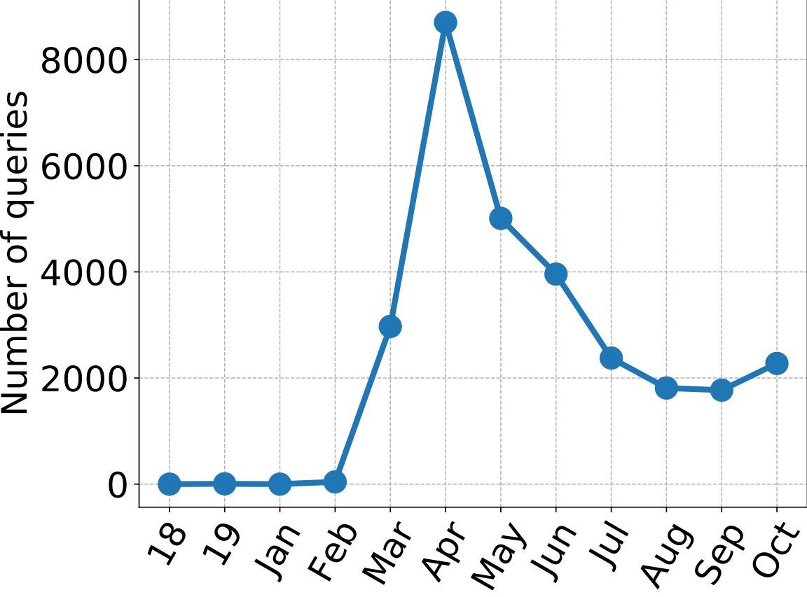

### Welcome!
We present a large-scale domain-specific dataset of click logs, obtained from user interactions of the [Trip Database](https://www.tripdatabase.com) health web search engine. Our clicklog dataset comprises approximately 5.2 million user interactionscollected between 2013 and 2020. We use this dataset to create a standard IR evaluation benchmark **TripClick** with around 700,000 unique free-text queries and 1.3 million pairs of query-document relevance signals, whose relevance is estimated by two click-through models. As such, the collection is one of the few datasets offering the necessary data richness and scale to train neural IR models with large amount of parameters, and notably the first in the health domain.

Available resources:
* TripClick Logs Dataset
* TripClick IR Benchmark
* TripClick Training Package for Deep Learning Models
* Related [publication](url)

Please consult the **Getting the Data** section if you wish to obtain one or more of the listed above.

### TripClick Logs Dataset
TheTripClicklogs dataset consists of the user interactions of the Trip search engine collected between January 2013 and October 2020. Each entry consists of date and time of search (in Unix time, in milliseconds),search session identifier, submitted query (Keywordsfield), document identifiers of the top 20 retrieved documents, and the metadata of the clicked document. For the clicked document, the provided data contains its unique identifier and URL. If the clicked document is a scientific publication, its title, DOI, and clinical areas are also stored. We should emphasize that the privacy of individual users is preserved in the clicked search logs by cautiously removing any personally identifiable information. The TripClicklogs dataset consists of approximately 5.2 million click log entries, appeared in around 1.6 million search sessions (∼3.3 interactions per session). The click logs contain around 1.6 million unique queries. These unique queries appear in the logs at varying frequencies. Examples of a frequent and a rare query are “asthma pregnancy”, and “antimicrobial activity of medicinal plants”, respectively. The log files contain approximately 2.3 million documents. Together with the dataset of click logs, we provide the corresponding titles and URLs of all documents. Examining the origin of clicked documents, we observe that approximately 80% of the documents point to articles in the MEDLINE catalog, around 11% to entries in https://clinicaltrials.gov, and the rest to various publicly available resources on the web.

Finally, looking at the query contents, figure above reports the number of times a query related to the COVID-19 virus is submitted to the search engine in the period of 2018-2020. The data for 2018 and 2019 are presented as annual sums, while for the year 2020,numbers are reported per month. While there are only few COVID-19-related queries before the February of 2020, the information needrapidly gains popularity with a peak in April. The provided data is potentially a useful resource for studying the COVID-19 pandemic,as well as the reaction and evolution of search engines regarding thesudden emergence of previously unknown/uncommon disease.

See [the paper](url) for more detail.

### TripClick IR Benchmark
**Documents** To create the TripClick benchmark, we use a subset of click log entries that refer to those documents that are indexed in the MEDLINE catalog. This subset encom-passes around 4 million log entries. The collection of documents that appear in the subset of click logs, results in approximately 1.5 million unique documents. For each document, we fetch the corresponding article from the MEDLINE catalog. Similar to the TREC Precision Medicine track we use the title and abstract of the articles as documents of the TripClick benchmark.

**Queries** The queries from the subset of click logs, comprise around 692,000 unique entities. We split thequeries into three groups, namely HEAD,TORSO, and TAIL, such that the queries in this sets cover 20%, 30%, and 50% of the search enginetraffic (according to the subset of click logs). This, in fact, results in assigning the queries with frequencies lower than 6 to TAIL, the ones between 6 and 44 to TORSO, and all the rest with frequencies higher higher than 44 to HEAD. While the numbers of unique queries in HEAD and TORSO are much smaller than those in TAIL, the former together still cover half of the search engine’straffic since their queries repeat much more often than the ones of TAIL.

**Relevance**  We provide two sets of query-to-document relevance signals, each created using a click-through model. The first relevance set, referred to as RAW, follows a simple approach by considering every clicked document as relevant to its corresponding query. The second set uses the Document Click-Through Rate (DCTR). Creating two sets using different click-through models provides insight about the effect of each click-through model on the final evaluation results, achieved using the corresponding relevance signals.

See [the paper](url) for more detail.

### TripClick DL Training Package
Our Training Package provides sufficiemt volume of data to facilitate training of deep neural IR models. It has structure similar to [MS MARCO](https://microsoft.github.io/msmarco/TREC-Deep-Learning-2019). Note that TripClick data is specific to health domain and user behaviour patterns present in it may differ significantly from ones observed in more general purpouse datasets.

See [the paper](url) for more detail and experiment reports.

### Getting the Data
We offer the three following resource packages:
1. TripClick Logs Dataset
2. TripClick IR Benchmark
3. TripClick Training Package for Deep Learning Models

One or more of the listed above can be requested for free via an email: [contact person](mailto:contact@person.com?subject=[TripClick]%20Data%20Request).
 Please, **specify needed data packages and intended use of the data**.

Below we describe contents of each package in detail.
#### TripClick Logs Dataset

| File Name | File Size | Format | Description |
|---|---:|---|---|
| allarticles.tar.gz | 235M |
| 2013.tar.gz | 56M | . | . |
| 2014.tar.gz | 62M | . | . |
| 2015.tar.gz | 61M | . | . |
| 2016.tar.gz | 91M | . | . |
| 2017.tar.gz | 103M | . | . |
| 2018.tar.gz | 115M | . | . |
| 2019.tar.gz | 103M | . | . |
| 2020.tar.gz | 77M | . | . |

Total: **900M**
#### TripClick IR Benchmark

| File Name | File Size | Format | Description |
|---|---:|---|---|
| collection.tar.gz | 875M | . | . |
| qrels.dctr.head.tar.gz | 2M | . | . |
| qrels.raw.head.tar.gz | 2M | . | . |
| qrels.raw.tail.tar.gz | 10M | . | . |
| qrels.raw.torso.tar.gz | 6M | . | . |
| topics.all.tar.gz | 13M | . | . |
| topics.head.tar.gz | 1M | . | . |
| topics.tail.tar.gz | 22M | . | . |
| topics.torso.tar.gz | 4M | . | . |

Total: **930M**

#### TripClick Training Package for Deep Learning Models

| File Name | File Size | Format | Description |
|---|---:|---|---|
| run.trip.BM25.head.test.tar.gz | 12M | . | . |
| run.trip.BM25.tail.test.tar.gz | 12M | . | . |
| run.trip.BM25.torso.test.tar.gz | 12M | . | . |
| triples.train.tsv.tar.gz | 28G | . | . |
| tuples.head.test.top200.tar.gz | 130M | . | . |
| tuples.head.val.top200.tar.gz | 131M | . | . |
| tuples.tail.test.top200.tar.gz | 134M | . | . |
| tuples.tail.val.top200.tar.gz | 134M | . | . |
| tuples.torso.test.top200.tar.gz | 132M | . | . |
| tuples.torso.val.top200.tar.gz | 132M | . | . |

Total: **29G**

### Terms and Conditions
### Legal Notices
### Contact Us
If you have any questions regarding the dataset, please contact us:
* Oleg Lesota (Johannes Kepler University, Linz, Austria)
* Navid Rekab-Saz (Johannes Kepler University, Linz, Austria)
